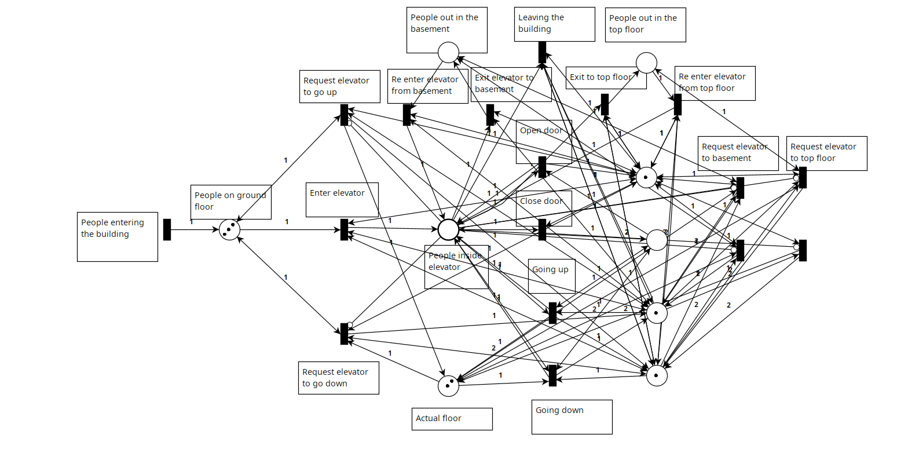

# Petri‑Net Modelling & Formal Analysis of a Three‑Floor Elevator 🚦🏢

This repository contains the **PIPE²** model and full formal analysis for a
single‑car elevator serving **Basement (B)**, **Ground (G)**, and **Top (T)**
floors.

*Tool‑chain:*  
[`pipe2`](https://github.com/sarahtattersall/PIPE) v5.0 • LaTeX/IEEEtran • Python
scripts for batch analyses (optional).

---

## 1 Overview
* **Places:** 9 (passengers, door status, encoded floor, motor flags)  
* **Transitions:** 17 (calls, door ops, movement, safety timers)  
* **Invariants:** 4 T‑, 3 P‑; conserves passengers & ensures mutual exclusivity  
* **Reachability:** 4 343 markings, **bounded** for \(n=3\) passengers  
* **Remaining risk:** deadlock only if door stays open indefinitely  
  (can be solved with an auto‑close timer)

---

## 2 Place Set & Initial Marking (`n = 3`)

| ID | Name                | Meaning                              | \(M_0\) |
|----|---------------------|--------------------------------------|:-------:|
| P1 | **G\_wait**         | passengers waiting at ground         | \(n\)   |
| P2 | **F\_level**        | encoded cabin level (0 B,1 T,2 G)    | 2       |
| P3 | **Inside**          | passengers inside cabin              | 0       |
| P4 | **B\_wait**         | passengers waiting in basement       | 0       |
| P5 | **T\_wait**         | passengers waiting on top            | 0       |
| P6 | **Door\_closed**    | door closed                          | 1       |
| P7 | **Door\_open**      | door open                            | 0       |
| P8 | **Dir\_up**         | motor “up’’ flag                     | 1       |
| P9 | **Dir\_down**       | motor “down’’ flag                   | 1       |

---

## 3 Transition Summary

| ID | Informal Meaning / Guard |
|----|--------------------------|
| **T1**  | press ▲ at G → `Req_up` |
| **T2**  | press ▼ at T → `Req_down` |
| **T3**  | cabin selects B (above B) |
| **T4**  | cabin selects T (below T) |
| **T5**  | open door |
| **T6**  | board while door open |
| **T7**  | alight B/G/T |
| **T8**  | close door |
| **T9**  | start up |
| **T10** | start down |
| **T11** | move up |
| **T12** | move down |
| **T13** | stop at floor |
| **T15–T18** | safety / timeout |

